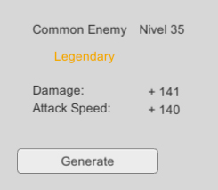

# WeaponStatsGenerator

Primer prototipo del generador de armas de Cacerolas y Dragones. 

Los stats del arma se generan basados en una serie de parametros (Tipo y nivel de monstruo).

Documentacion de diseño:
https://drive.google.com/open?id=1Y_2KbVT589ap6GXcMspXMTgZJABZUjjmxBt-6ditp08
